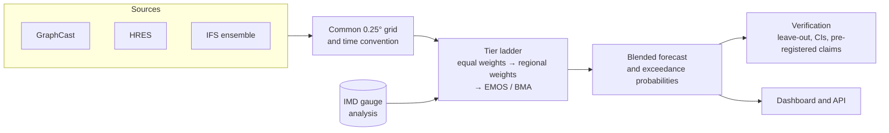

<div align="center">

# WEAVR

### Hybrid AI–NWP multi-model rainfall forecast blending for India

*Weigh every forecast model by how much it has actually earned, region by region and lead by lead, and be honest about what the evidence does and does not show.*

[](https://github.com/ATMOSYNC/WEAVR/actions/workflows/ci.yml)


[Why WEAVR](#why-weavr) · [What it does](#what-it-does) · [The dashboard](#the-dashboard) · [Quick start](#quick-start) · [Evidence](#evidence-and-honesty) · [Documentation](#documentation)

</div>

---

## Why WEAVR

The monsoon is forecast today by a growing crowd of models: physics-based
numerical weather prediction (NWP) such as ECMWF's HRES and IFS ensemble, and
a new generation of AI models such as Google's GraphCast. Each is good in
some places, at some lead times, for some kinds of rain, and poor in others.
No single model is best everywhere, and simply averaging them throws away
what is known about each one's strengths.

**WEAVR blends them properly.** It learns, from history, how much to trust
each model in each region of India at each lead time, produces a single
blended forecast and calibrated exceedance probabilities at the thresholds
India's weather service (IMD) warns on, and verifies every claim against IMD
rain-gauge analyses using a leave-out protocol that never lets the test data
leak into training.

> **A research prototype, not an official product.** WEAVR is not an IMD or
> NCMRWF product. Any warnings it shows are demonstrations.

## What it does

<table>
<tr>
<td width="50%" valign="top">

### Blend
- Combines **GraphCast, HRES and the IFS ensemble** for rainfall (Pangu for
  temperature) on a common **0.25° India grid**, 6.5–38.5°N, 66.5–100.0°E
- **Lead times of 24 to 96 h** for the June–September monsoon
- Regional, lead-specific weights instead of one global average

</td>
<td width="50%" valign="top">

### Calibrate
- A ladder of methods, each benchmarked against the last: equal-weight mean,
  regional weights, hierarchical EMOS and BMA, and a regime-conditioned
  variant
- **Probabilities at IMD's rain thresholds**, not just a single number
- Drift detection and weight renormalisation when a source drops out

</td>
</tr>
<tr>
<td width="50%" valign="top">

### Verify
- Leave-one-year-out and seasonal-block splits only; **never a random split**
- RMSE, bias, ACC, CRPS, Brier, SEEPS, FSS and POD/FAR/CSI/ETS
- Paired block bootstrap and Diebold–Mariano tests, with claims
  **pre-registered** before they are tested

</td>
<td width="50%" valign="top">

### Explore
- An interactive dashboard: weight map, skill trends, blended map and
  extreme-probability map in IMD's colour scheme
- An optional **offline OpenStreetMap basemap** under the forecast grid
- A daily pipeline for live forecasts and verification

</td>
</tr>
</table>

## How it works



Every stage is a small, tested module in `src/weavr/`: `grid`, `ensemble`,
`weighting`, `emos`, `bma`, `regions`, `verify`, `significance`,
`climatology`, `independence`, `drift`, `renormalize`, `stacking` and
`quantile_mapping`, with the runnable pipelines in `scripts/`.

### Tail repair: Quantile mapping (`weavr.quantile_mapping`)

To repair under-forecast extreme rainfall before blending or parametric fitting, WEAVR provides empirical quantile mapping calibrated against historical IMD gauge analyses (`fit_quantile_map`, `apply_quantile_mapping`). It zeroes dry/drizzle values below a data-driven wet-day threshold (0.1 mm), performs linear quantile interpolation across wet ranks, and preserves forecast extreme anomalies above historical training maximums via an additive upper-tail extrapolation rule.

### Tier 2b: Combiner meta-blend (`weavr.stacking`)

WEAVR meta-blends distributional combiners (EMOS-CSG and BMA) through three stacking strategies (`weavr.stacking`): per-bin selection (applying each method where its training density is well-supported), linear density pooling with weights $\alpha \cdot f_{\text{EMOS}} + (1-\alpha) \cdot f_{\text{BMA}}$, and quantile averaging across the predictive distributions with exact root-finding quantile inversion for the censored shifted gamma distribution (CSGD).


## The dashboard

A FastAPI service (`dashboard/api.py`) serves a dependency-light front end
(`dashboard-web/`, plain HTML, CSS and JavaScript, no build step).

| View | What it shows |
|---|---|
| **Weight map** | Which model earns the most trust in each region, by lead |
| **Skill trends** | RMSE and CRPS by lead, blend against every raw source |
| **Blended map** | The blended rainfall forecast on the grid, in IMD's rain bins |
| **Extreme-probability map** | The probability of exceeding a warning threshold, with fallback cells marked |

The two maps have a **Show geography** switch that draws the forecast grid
over a basemap built from **OpenStreetMap** data and served from a local
file, so it works with no internet connection. The basemap deliberately draws
**no national or disputed boundaries**; an official outline you supply is
drawn on top. It falls back to the plain grid if the tiles or WebGL are
missing. Details: [docs/basemap-scope.md](docs/basemap-scope.md).

## Quick start

```bash
git clone https://github.com/ATMOSYNC/WEAVR.git
cd WEAVR
python -m venv .venv && source .venv/bin/activate
pip install -e ".[dev,dashboard-api]"

uvicorn dashboard.api:app --port 8000
```

Then open <http://127.0.0.1:8000/>. The dashboard runs out of the box on the
committed example grids in `dashboard/data/`.

**Optional: the offline basemap**

```bash
brew install pmtiles                 # once (see docs/basemap-scope.md for other platforms)
python scripts/build_basemap.py      # about 40 s, 148 MB, gitignored
```

**Rebuilding the results** needs the large forecast and observation stores,
which are not in the repository (`data/` is gitignored). The order, sources
and licences are in [docs/data-sources.md](docs/data-sources.md) and
[docs/baseline-store.md](docs/baseline-store.md).

For the second monsoon season, run the baseline and lagged builders with
`--year 2018`, then validate with `scripts/validate_daily_stores.py --year 2018
--no-require-ifs-ens`. The year-specific archive map and
`weavr.stores.open_multi_season` join matching 2018 and 2020 groups for the
next leave-one-year-out evaluation. See the
[2018 store notes](docs/baseline-store.md#second-season-2018) for the data
and full-member IFS-ENS scope.

## Evidence and honesty

WEAVR is built around reporting what the data shows, including the parts that
do not flatter it. Measured on the 2020 monsoon season against IMD gauges:

- **No blend beats raw GraphCast on RMSE at 24–96 h.** Only Tier 2's EMOS
  calibrations do, and those are single-source calibrations. The value of
  blending has to be argued on other grounds, and the project's next steps
  are aimed squarely at it.
- **The three sources are worth about 1.1 independent models.** Their errors
  correlate at 0.62–0.90, which is why plain averaging fails and why adding a
  genuinely different source matters more than re-weighting.
- **Extremes are the open problem.** GraphCast detects no 115.6 mm event at
  any lead, and no source detects any 204.5 mm event. RMSE and warning skill
  point in opposite directions.
- **A regime-conditioned tier was tested and rejected** against
  pre-declared criteria, and the no-go is documented.
- **The test sets are small** (a single season), so most comparisons do not
  yet have meaningful confidence intervals. More seasons are the next step.

Numbers, method and caveats:
[single-source and independence](docs/single-source-and-independence-results.md),
[scorecard and significance](docs/scorecard-and-significance.md),
[pre-registered claims](docs/preregistration.md).

## Repository layout

```
src/weavr/        the library: grid, blending, calibration, verification
scripts/          data-store builders, tier runners, scorecard, daily pipeline
dashboard/        FastAPI service and example data
dashboard-web/    the front end (vanilla JS, vendored MapLibre and pmtiles)
results/          committed result tables (CSV)
docs/             scope notes, result write-ups, the development log
tests/            unit and API tests
Improvements/     the forward plan: steps, order and execution prompts
```

## Development

```bash
pip install -e ".[dev]"
ruff check .
mypy src
pytest --cov=weavr
```

CI runs lint, type-check and tests on Python 3.11 and 3.12 for pull requests
that touch code or committed results (documentation-only and front-end-only
changes skip it). Split data with `weavr.splits` only, never a random split.

## Documentation

| | |
|---|---|
| Plan and history | [Phase plan](docs/phase-plan.md) · [Development log](docs/development-log.md) · [Improvement plan](Improvements/WEAVR-SIH-improvement-plan.md) · [Execution plan](Improvements/EXECUTION-PLAN.md) |
| Data | [Data sources](docs/data-sources.md) · [Grid and time convention](docs/grid-and-time-convention.md) · [Baseline store](docs/baseline-store.md) |
| Methods and results | [Tier 0](docs/tier0-baseline-results.md) · [Tier 1](docs/tier1-regional-weights-results.md) · [Tier 2](docs/tier2-hierarchical-baseline-results.md) · [Tier 2b combined](docs/tier2b-combined-results.md) · [Tail repair](docs/tail-repair-results.md) · [Regime conditioning](docs/phase5-regime-conditioned-results.md) |
| Dashboard | [Dashboard scope](docs/phase7-dashboard-scope.md) · [Basemap](docs/basemap-scope.md) |

## Acknowledgements and data

Forecast data: ECMWF open data (CC BY 4.0), WeatherBench 2 and Google
DeepMind's GraphCast. Observations: India Meteorological Department gridded
rainfall. Basemap: © OpenStreetMap contributors (ODbL), served via
Protomaps, with Natural Earth and MapLibre GL JS. Each source's licence and
attribution is recorded in [docs/data-sources.md](docs/data-sources.md) and
[docs/basemap-scope.md](docs/basemap-scope.md).

## License

MIT, as declared in `pyproject.toml`.

<div align="center"><sub>Built for Smart India Hackathon, problem statement 26081.</sub></div>
